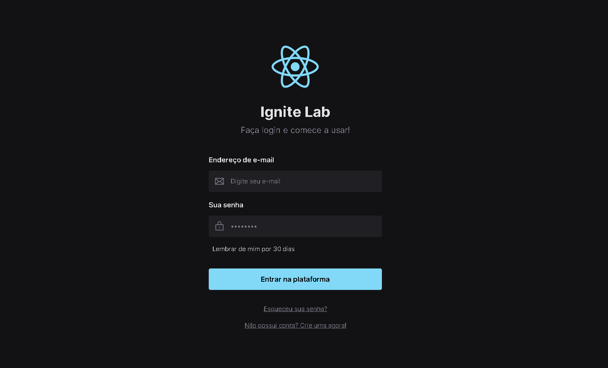

# Ignite Lab - React Design System 

## Índice
* Introdução
* Tecnologias utilizadas
* Ferramentas utilizadas
* Serviços utilizados
* Autor
* Contato

## ⚙️ Introdução 

Projeto de uma tela de login construído durante o evento do Ignite Lab, da Rocketseat

#

## 🖥️ Tecnologias utilizadas

- ``Figma``
- ``React``
- ``Vite``
- ``TailwindCss``
- ``Storybook``
- ``Axios``
- ``Radix ui``
- ``Phosphor react``
- ``Msw``
- ``clsx``

## 🛠️ Ferramentas utilizadas

- ``Visual Studio Code``

## 🧰 Serviços utilizados

- ``Github``

#

## 👤 Autor

| [ Gustavo Casagrande Borges](https://github.com/gustavotht21) |  
| :---: | 

#

## ✉️ Contato

Entre em contato via e-mail: borges.gustavo@estudante.ifro.edu.br
